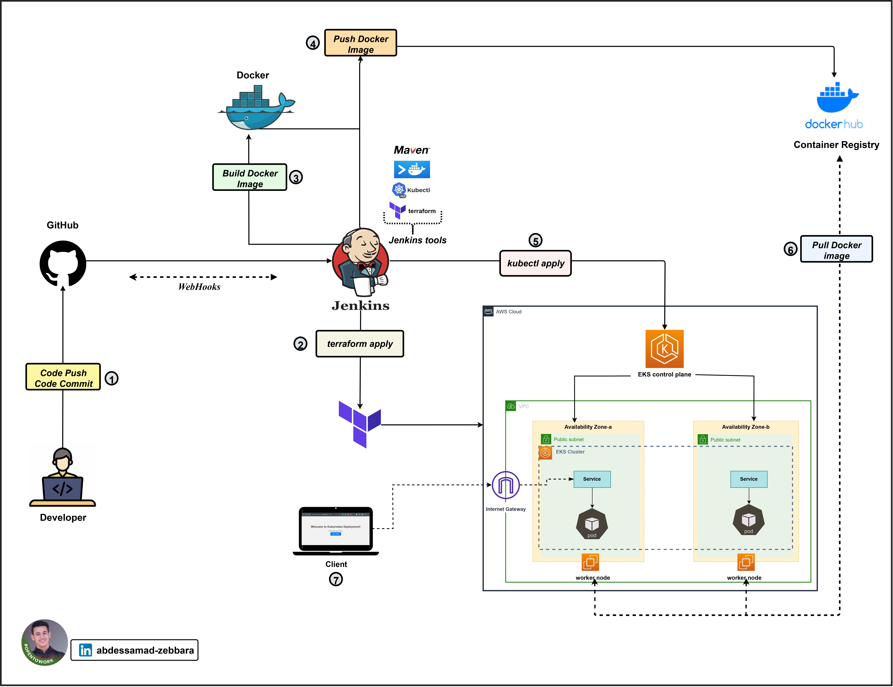
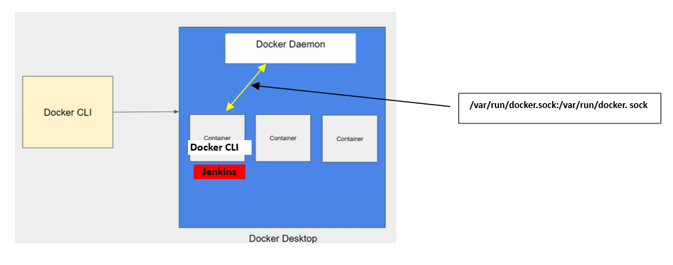
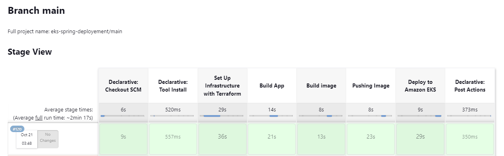
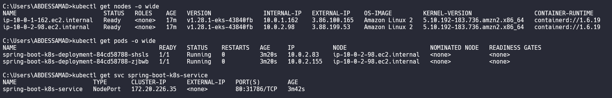
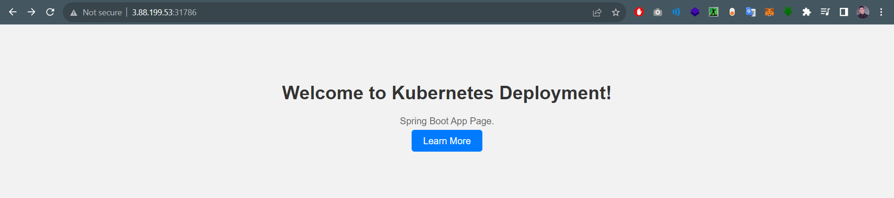

# Automate Infrastructure Setup and Deployment of a Spring Application on AWS EKS Cluster

<br/>



## Table of Contents

- [Prerequisites](#prerequisites)
- [Getting Started](#getting-started)
- [Jenkins Setup](#jenkins-setup)
- [Jenkins Plugins and Credentials](#jenkins-plugins-and-credentials)
- [GitHub Repository](#github-repository)
- [Jenkins Configuration](#jenkins-configuration)
- [Pipeline Stages](#pipeline-stages)
- [Verification](#verification)
- [License](#license)

## Prerequisites

Before you begin, ensure you have the following tools and services set up:

- **Amazon Web Services (AWS) Account**: You will need an AWS account to create and manage Amazon EKS clusters.

- **Jenkins Server**: Set up a Jenkins server for continuous integration and continuous deployment (CI/CD). 

- **Kubernetes Cluster**: You can use Amazon EKS or a Kubernetes cluster for container orchestration.

- **Docker**: Install Docker to build and run Jenkins as a Docker container.

- **Git**: Git is required for version control and managing your code.

- **GitHub Account**: You will use GitHub for source code management (SCM) as your Git repository. Push your Jenkinsfile, application, and deployment files to your GitHub repository.

- **Docker Hub Account**: You will use Docker Hub as your container registry to store Docker images.

### Getting Started

---

1. Clone this repository to your local machine:

   ```bash
   git clone https://github.com/ZebbaraAbdessamad/DevOps-Project.git
    ```

2. Change to the project directory:

   ```bash
   cd DevOps-Project
   ````


### Jenkins Setup

---
To automate the deployment process, you'll need a custom Jenkins image that includes Docker CLI, kubectl, and Terraform.

Here is a demonstration of how the Docker daemon works



You can create this image using the following Dockerfile:
  ```bash
    # Use the official Jenkins LTS base image
    FROM jenkins/jenkins:lts
    
    # Switch to the root user to install Docker
    USER root
    
    # Install Docker using the official Docker installation script
    RUN curl -fsSL https://get.docker.com -o get-docker.sh && sh get-docker.sh

    # Install kubectl
    RUN curl -LO "https://dl.k8s.io/release/$(curl -L -s https://dl.k8s.io/release/stable.txt)/bin/linux/amd64/kubectl" && \
    chmod +x kubectl && \
    mv kubectl /usr/local/bin/

    # Install Terraform
    RUN apt-get update && apt-get install -y wget unzip && \
    wget https://releases.hashicorp.com/terraform/0.14.7/terraform_0.14.7_linux_amd64.zip && \
    unzip terraform_0.14.7_linux_amd64.zip && \
    mv terraform /usr/local/bin/
    
    # Add the Jenkins user to the docker group to run Docker commands without sudo
    RUN usermod -aG docker jenkins
    
    # Switch back to the Jenkins user
    USER jenkins

```
Build this Docker image and run your Jenkins server using the following command:

  ```bash
    docker run -d -p 8080:8080 -p 50000:50000
    -v /var/run/docker.sock:/var/run/docker.sock 
    -v /var/jenkins_home:/var/jenkins_home
    --name custom-jenkins custom-jenkins-image

```

### Jenkins Plugins and Credentials

---
Ensure that the following Jenkins plugins are installed:

* **Maven Plugins**: For building Maven projects.
* **Docker Plugins**: For integrating Docker with Jenkins.
* **Kubernetes Plugins**: For deploying applications to Kubernetes clusters.
* **GitHub Integration Plugins**: For integrating Jenkins with GitHub repositories.
* **Multibranch Scan Webhook Trigger Plugin**: For triggering pipeline builds on GitHub webhook events.


Configure the following credentials in Jenkins:


- **GitHub Credentials**: For connecting to your GitHub repository.
- **Kubernetes Credentials (config file)**: For connecting to your Kubernetes cluster.
- **Docker Hub Credentials**: For pushing Docker images.
- **AWS Credentials**: For authenticating with Amazon Web Services (AWS) when interacting with AWS resources during the deployment process.


### GitHub Repository

---
This GitHub repository will host your application code, Docker configurations, and Jenkinsfile.


### Jenkins Configuration

----

Set up your Jenkins environment with the following configurations:

- ***Create a Jenkins pipeline job and configure it to use the Jenkinsfile provided in this repository.***
- ***Define tools in the pipeline, specifying the name of the Maven installation defined in Jenkins.***
- ***Set environment variables in the pipeline to specify the AWS region and Docker image name.***
- ***Configure pipeline stages to perform infrastructure setup, application building, image creation, image pushing to Docker Hub, and deployment to Amazon EKS.***


### Jenkins Pipeline Stages

----

The Jenkins pipeline includes the following stages:

* **Set Up Infrastructure with Terraform:** This stage sets up the infrastructure using Terraform, including the Amazon EKS cluster.

* **Build App:** This stage builds the Spring Boot application using Maven.

* **Build Docker Image:** Create a Docker image of the Spring Boot application.

* **Pushing Image:** Push the Docker image to a Docker registry (e.g., Docker Hub).

* **Deploy to Amazon EKS:** Deploy the application to the Amazon EKS cluster.




### Verification

---

You can access the Spring Boot application deployed on Amazon EKS by using the worker node's IP address and the service's NodePort.

Here's how you can do it:

1. Retrieve the public IP address of one of the worker nodes in your Amazon EKS cluster.

```bash
  kubectl get nodes -o wide
```

2. Run the following command to get the NodePort associated with your Spring Boot service:

```bash
  kubectl get svc spring-boot-k8s-service
```

The output will be like this:




Copy the ip address and paste it into your browser to access the deployed containerized application




### License

---

The code and documentation in this repository are provided under the following license:

[MIT License](https://opensource.org/licenses/MIT)

© 2023 Zebbara Abdessamad
