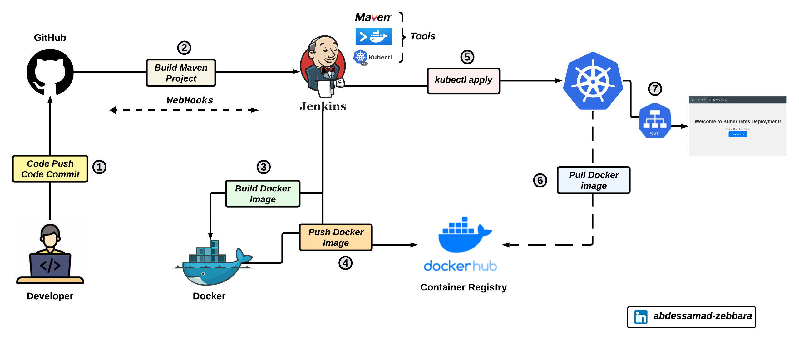
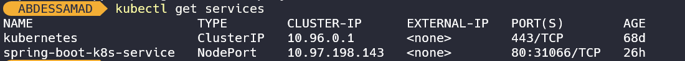
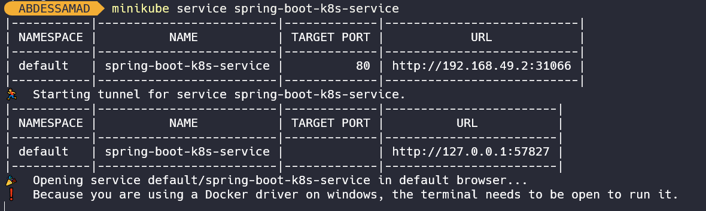
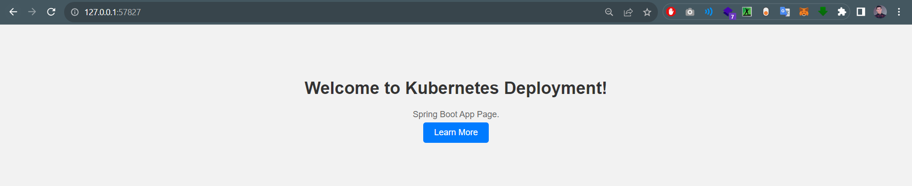

# Automated CI/CD for Containerized Spring Boot Applications in Kubernetes Cluster 

<br/>



## Table of Contents

- [Prerequisites](#prerequisites)
- [Getting Started](#getting-started)
- [Jenkins Custom Image](#jenkins-custom-image)
- [Jenkins Plugins](#jenkins-plugins)
- [Jenkins Credentials](#jenkins-credentials)
- [Start Minikube](#start-minikube)
- [Test Connection](#test-connection)
- [Jenkins Pipeline Stages](#jenkins-pipeline-stages)
- [Verification](#verification)
- [Contributing](#contributing)
- [License](#license)

## Prerequisites

Before you begin, ensure you have the following tools and services set up:

- [Jenkins Server](https://jenkins.io/): Jenkins server for continuous integration and continuous deployment (CI/CD).
- [Kubernetes Cluster](https://kubernetes.io/): Kubernetes cluster for container orchestration (e.g., minikube).
- [Docker Desktop](https://www.docker.com/): You will use Docker to build and run Jenkins as a Docker Container.
- [Git](https://git-scm.com/): Version control system for managing your code.
- [GitHub Account](https://git-scm.com/): You will use GitHub as your Source Code Management (SCM) Git repository. You will push your Jenkinsfile, application, and deployment files to your GitHub repository.
- [Docker Hub Account](https://git-scm.com/): You will use Docker Hub as your container registry to store Docker images.

### Getting Started

---

1. Clone this repository to your local machine:

   ```bash
   git clone https://github.com/ZebbaraAbdessamad/deploy-spring-boot-on-k8s-using-jenkins.git
    ```

2. Change to the project directory:

   ```bash
   cd your-spring-boot-app
   ````


### Jenkins Custom Image

---
To automate the deployment process, you'll need a custom Jenkins image that includes Docker CLI and kubectl.

Here is a demonstration of how the Docker daemon works


You can create this image using the following Dockerfile:
  ```bash
      # Use the official Jenkins LTS base image
      FROM jenkins/jenkins:lts
      
      # Switch to the root user to install Docker
      USER root
      
      # Install Docker using the official Docker installation script
      RUN curl -fsSL https://get.docker.com -o get-docker.sh && sh get-docker.sh
      
      # Add the Jenkins user to the docker group to run Docker commands without sudo
      RUN usermod -aG docker jenkins
      
      # Install kubectl
      RUN curl -LO "https://dl.k8s.io/release/$(curl -L -s https://dl.k8s.io/release/stable.txt)/bin/linux/amd64/kubectl" && \
      chmod +x kubectl && \
      mv kubectl /usr/local/bin/
      
      # Switch back to the Jenkins user
      USER jenkins
```

Build this Docker image and use it for your Jenkins server with both Docker and kubectl installed.

Run your Jenkins server (don't forget to make Jenkins and Minikube cluster in the same network)

  ```bash
   docker run -d -p 8080:8080 -p 50000:50000 
   -v /var/run/docker.sock:/var/run/docker.sock 
   -v /home/abdessamad/www/jenkins_home:/var/jenkins_home 
   --network minikube --name custom-jenkins custom-jenkins-image
```

### Jenkins Plugins

---
Ensure that the following Jenkins plugins are installed:

* **Maven Plugins**: For building Maven projects.
* **Docker Plugins**: For integrating Docker with Jenkins.
* **Kubernetes Plugins**: For deploying applications to Kubernetes clusters.
* **GitHub Integration Plugins**: For integrating Jenkins with GitHub repositories.
* **Multibranch Scan Webhook Trigger Plugin**: For triggering pipeline builds on GitHub webhook events.


### Jenkins Credentials

---
Configure the following credentials in Jenkins:

* **GitHub's credentials** : For connecting to your GitHub repository.
* **Kubernetes credentials (config file)** : For connecting to your Kubernetes cluster.
* **DockerHub credentials** :For pushing Docker images.


### Start Minikube

---
 ```bash
  minikube start
```

### Test Connection

---
Ensure that Jenkins can successfully connect to your Kubernetes cluster and Docker registry, GitHub (webhooks). Test the connections in the Jenkins configuration.


### Jenkins Pipeline Stages

The Jenkins pipeline includes the following stages:

* ***<span style="color: blue;">Build App</span>***: Build the Spring Boot application using Maven.

* ***<span style="color: green;">Build Docker Image</span>***: Create a Docker image of the Spring Boot application.

* ***<span style="color: orange;">Push Docker Image</span>***: Push the Docker image to a Docker registry (e.g., Docker Hub).

* ***<span style="color: purple;">Deploy to Kubernetes</span>***: Deploy the application to the Kubernetes cluster.


### Verification

---

You will use the Kubernetes Service to access the spring boot application container from outside the Kubernetes cluster.

To get the Kubernetes Service, run this command:
```bash
  kubectl get services
```
The command will output the following Kubernetes Service in your terminal:



You will then run the following command to get the URL:

```bash
  minikube service spring-boot-k8s-service
```
The command will output the following URL:




Copy the URL and paste it into your browser to access the deployed containerized application



### Contributing

---
Contributions are welcome! If you have any suggestions or improvements, please create an issue or a pull reques

### License


---

The code and documentation in this repository are provided under the following license:

[MIT License](https://opensource.org/licenses/MIT)

© 2023 Zebbara Abdessamad
# DevOps-Project
